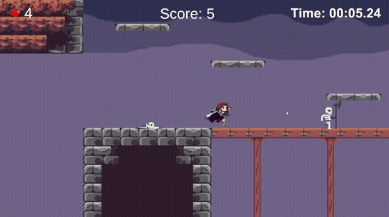
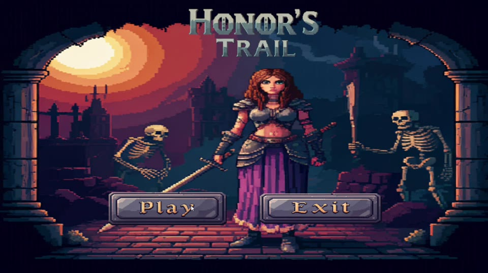
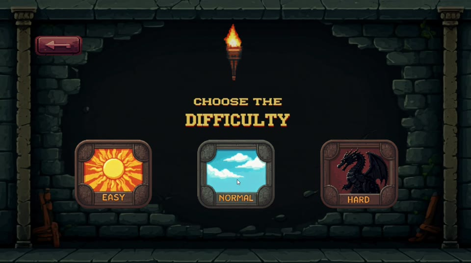
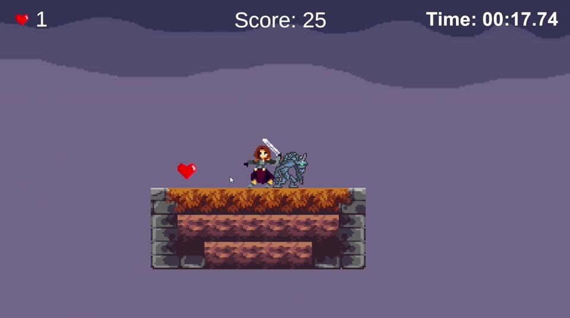
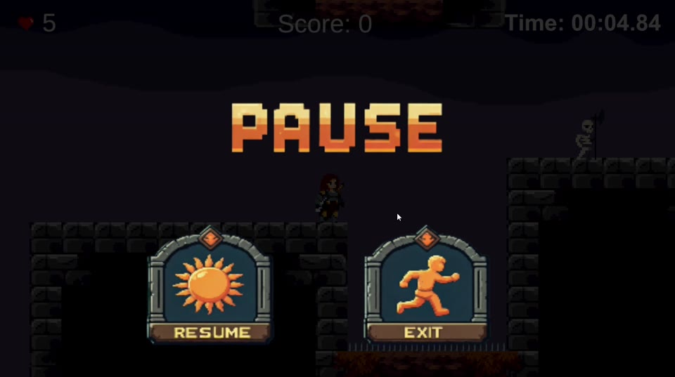
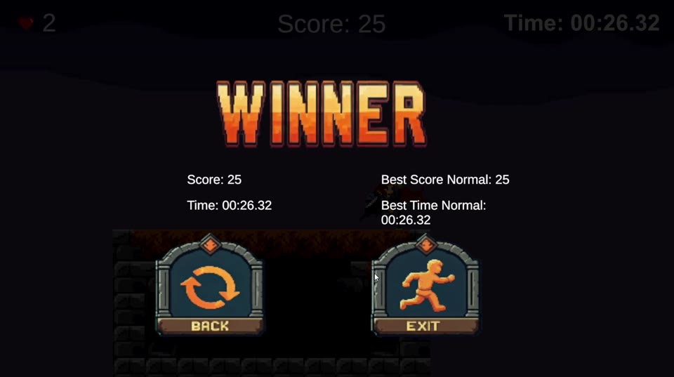
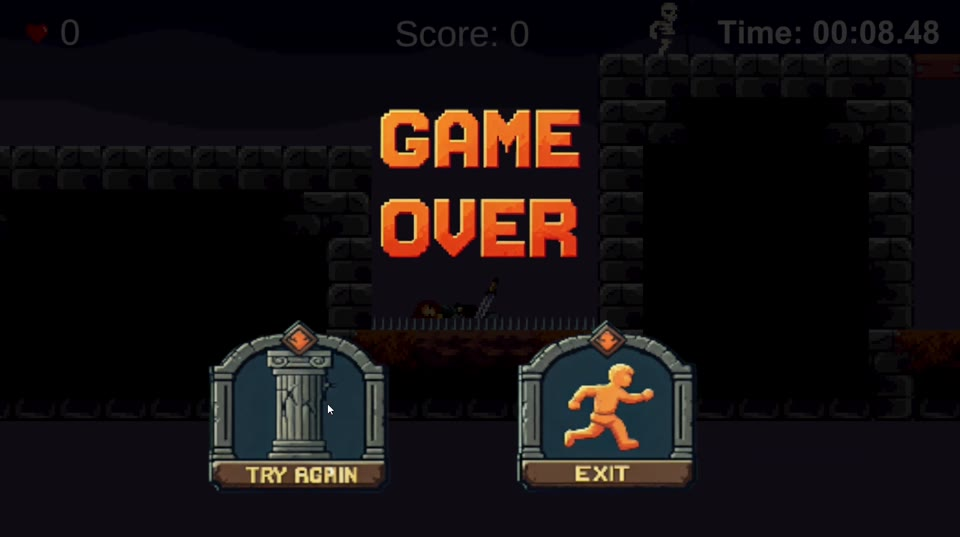

# Honor's Trail

Jogo de plataforma 2D em pixel art feito na Unity. Você controla uma guerreira armada com uma espada e precisa atravessar ruínas de pedra cheias de esqueletos, gárgulas, espinhos e plataformas que desabam até chegar à bandeira no fim da fase, fazendo a maior pontuação no menor tempo possível.

<p align="center">
  
</p>

## Screenshots

| Menu principal | Escolha de dificuldade |
| :---: | :---: |
|  |  |
| **Gameplay** | **Pausa** |
|  |  |
| **Vitória** | **Game Over** |
|  |  |

## Como jogar

O objetivo é chegar até a bandeira no fim da fase. No caminho, derrote inimigos para ganhar pontos e pegue corações para recuperar vida. A HUD mostra a vida, a pontuação e o cronômetro da partida.

### Controles

| Ação | Teclado | Controle |
| --- | --- | --- |
| Mover | `A` / `D` ou `←` / `→` | Analógico esquerdo |
| Pular (pulo duplo no ar) | `Espaço` | Botão 3 |
| Atacar com a espada | `Ctrl esquerdo` ou clique esquerdo | Botão 0 |
| Pausar / continuar | `Esc` | Botão 1 |

### Inimigos

| Inimigo | Comportamento | Pontos |
| --- | --- | --- |
| **Esqueleto (Keeper)** | Patrulha de um lado para o outro e ataca com a alabarda quando você chega perto | 5 |
| **Gárgula (Gizmo)** | Fica parada até você entrar na área dela, depois te persegue e ataca | 10 |

Cada ataque inimigo que acerta tira 1 ponto de vida.

### Armadilhas e itens

- **Espinhos**: morte instantânea ao encostar.
- **Plataformas que caem**: desabam logo depois que você pisa nelas e voltam ao lugar alguns segundos depois.
- **Corações**: recuperam 1 ponto de vida.

### Dificuldade

A dificuldade escolhida define quantos golpes cada inimigo aguenta:

| Dificuldade | Golpes para derrotar um inimigo |
| --- | --- |
| Easy | 2 |
| Normal | 4 |
| Hard | 6 |

### Recordes

Ao terminar a fase, a tela **Winner** mostra sua pontuação e seu tempo ao lado do melhor resultado naquela dificuldade. Ganha o recorde quem fizer mais pontos; em caso de empate, vale o menor tempo. Os recordes ficam salvos localmente (PlayerPrefs), um para cada dificuldade.

## Como abrir o projeto

1. Instale a **Unity 2022.3.16f1** (LTS) pelo Unity Hub.
2. Clone o repositório:
   ```bash
   git clone https://github.com/EduardoColet/Unity-2D-Plataform-Game.git
   ```
3. No Unity Hub, clique em **Add** e selecione a pasta `2D_game/My project/My project`.
4. Abra a cena `Assets/Scenes/Menu.unity` e aperte **Play**.

## Estrutura do projeto

```
2D_game/My project/My project/Assets/
├── Scenes/          Menu, SelectDificult, lvl1, AboutGame
├── Scripts/
│   ├── Player/      movimento, pulo duplo, ataque, vida e pontuação
│   ├── Enimies/     Keeper (esqueleto) e Gizmo (gárgula)
│   ├── Traps/       espinhos e plataformas que caem
│   ├── Menu/        menu principal e escolha de dificuldade
│   ├── Globals/     telas de vitória e game over
│   ├── Timer/       cronômetro da partida
│   └── EndGame/     gatilho de fim de fase
├── Prefabs/         objetos reutilizáveis
├── Animation/       animações do jogador e dos inimigos
└── Sounds/          efeitos sonoros
```

## Tecnologias

- Unity 2022.3.16f1
- C#
- TextMesh Pro
